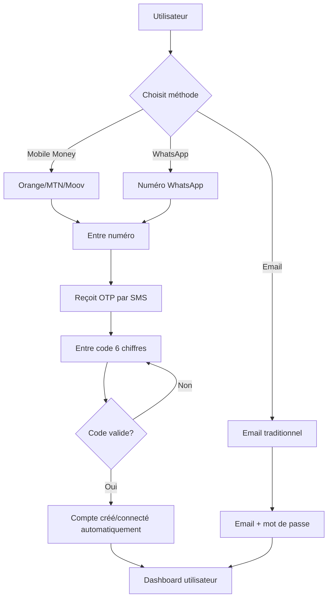

# Authentification Adaptée au Contexte Ivoirien

## 🌍 Contexte et Réalité du Terrain

### Situation des Utilisateurs en Côte d'Ivoire

**Ce que la majorité des utilisateurs ont :**
- ✅ Un téléphone (smartphone Android ou téléphone basique)
- ✅ Un compte Mobile Money (Orange Money, MTN, ou Moov Money)
- ✅ WhatsApp installé et utilisé quotidiennement
- ✅ Un compte Google (lié au téléphone Android)

**Ce qu'ils n'ont PAS nécessairement :**
- ❌ Une adresse email active et consultée régulièrement
- ❌ L'habitude de gérer des mots de passe complexes
- ❌ L'habitude des processus d'inscription web traditionnels

### Les Défis de l'Authentification Traditionnelle

1. **Email + Mot de passe** : Barrière à l'entrée trop élevée
   - Beaucoup d'utilisateurs n'ont pas d'email
   - Ceux qui en ont un ne le consultent pas régulièrement
   - Difficulté à retenir les mots de passe
   - Processus de récupération complexe

2. **OAuth Social (Google, Facebook)** : Nécessite configuration complexe
   - Requiert accès aux paramètres Supabase
   - Configuration technique des APIs
   - Dépendance aux services externes
   - Pas adapté aux utilisateurs sans email

## 💡 Notre Solution : Authentification par Numéro de Téléphone

### Principe de Base

**Un seul identifiant universel : le numéro de téléphone**

Chaque utilisateur se connecte avec son numéro de téléphone, peu importe la méthode :
- Mobile Money (Orange, MTN, Moov)
- WhatsApp
- (Futur) SMS simple

### Hiérarchie des Méthodes

```
1️⃣ RECOMMANDÉE : Mobile Money
   ↳ Le numéro sert aussi pour les paiements
   ↳ Intégration native avec les services financiers
   ↳ Familier pour tous les utilisateurs

2️⃣ ALTERNATIVE : WhatsApp
   ↳ Application la plus utilisée en Côte d'Ivoire
   ↳ Pas besoin d'avoir WhatsApp installé
   ↳ Le numéro suffit pour l'authentification

3️⃣ OPTIONNELLE : Email/Mot de passe
   ↳ Pour les utilisateurs avancés
   ↳ Pour les administrateurs système
   ↳ Reste disponible mais pas mise en avant
```

## 🔐 Architecture Technique

### Flux d'Authentification Simplifié



### Stockage des Identités

Chaque utilisateur peut avoir plusieurs identités liées :

```typescript
{
  id: "uuid",

  // Identifiant principal
  phone: "+2250712345678",

  // Méthodes d'authentification
  primary_auth_method: "mobile_money",
  auth_methods_used: ["mobile_money", "whatsapp"],

  // Mobile Money
  mobile_money_operator: "orange",
  mobile_money_verified: true,

  // WhatsApp
  whatsapp_phone: "+2250712345678",
  whatsapp_name: "Kouassi Jean",
  whatsapp_verified: true,

  // Email (optionnel ou temporaire)
  email: "2250712345678@mobilemoney.local",

  // Google (si disponible)
  google_email: "jean.kouassi@gmail.com",
  google_name: "Jean Kouassi"
}
```

## 🚀 Avantages de Cette Approche

### Pour les Utilisateurs

1. **Simplicité Maximale**
   - Un seul numéro à retenir (qu'ils connaissent déjà)
   - Pas de mot de passe à mémoriser
   - Connexion en 2 étapes : numéro → code

2. **Familiarité**
   - Processus similaire à l'activation Mobile Money
   - Identique à la vérification WhatsApp
   - Pas besoin de formation

3. **Sécurité**
   - Code OTP unique à chaque connexion
   - Expiration rapide (5 minutes)
   - Lié au téléphone physique de l'utilisateur

### Pour le Projet

1. **Pas de Dépendances Externes**
   - Fonctionne sans configuration OAuth
   - Pas besoin d'accès admin Supabase pour démarrer
   - Indépendant des services Google/Facebook

2. **Évolutif**
   - Facile d'ajouter de nouvelles méthodes
   - Compatible avec l'intégration future de paiements
   - Prépare WhatsApp Business API

3. **Conversion Optimale**
   - Barrière à l'entrée minimale
   - Taux d'inscription plus élevé
   - Moins d'abandons dans le tunnel

## 📱 Cas d'Usage Réels

### Cas 1 : Commerçant Sans Email

**Profil :** Fatou, vendeuse au marché d'Adjamé
- Téléphone : Nokia avec WhatsApp
- Pas d'email
- Compte Orange Money actif

**Parcours :**
1. Ouvre l'application
2. Tape son numéro Orange Money : 07 12 34 56 78
3. Reçoit un SMS avec le code : 123456
4. Entre le code → Connectée !
5. Son compte est créé automatiquement
6. Peut commencer à vendre immédiatement

### Cas 2 : Producteur Rural

**Profil :** Kouadio, cultivateur de cacao à Daloa
- Téléphone Android basique
- WhatsApp pour communiquer avec sa coopérative
- Pas d'habitude d'utiliser des emails

**Parcours :**
1. Choisit "WhatsApp" comme méthode
2. Entre son numéro : 05 67 89 01 23
3. Reçoit le code par SMS
4. Se connecte
5. Peut vendre ses récoltes via la plateforme

### Cas 3 : Gestionnaire de Coopérative

**Profil :** Marie, gérante de coopérative agricole
- Smartphone Samsung
- Email professionnel
- Compte MTN Money pour les transactions

**Parcours :**
1. Utilise son numéro MTN Money pour se connecter
2. Lie ensuite son email pour les notifications importantes
3. Peut basculer entre les deux méthodes
4. Gère les membres de sa coopérative

## 🛠️ Implémentation Technique

### Configuration Minimale

Aucune configuration OAuth n'est nécessaire au départ :

```typescript
// Pas besoin de ça :
❌ GOOGLE_CLIENT_ID
❌ GOOGLE_CLIENT_SECRET
❌ FACEBOOK_APP_ID
❌ FACEBOOK_APP_SECRET

// Juste ça suffit :
✅ VITE_SUPABASE_URL
✅ VITE_SUPABASE_ANON_KEY
```

### Mode Démo vs Production

**Mode Démo (Actuel) :**
- OTP affiché dans la console navigateur
- Pas d'envoi SMS réel
- Stockage localStorage temporaire
- Parfait pour les tests et démonstrations

**Mode Production (À implémenter) :**
```env
# APIs SMS des opérateurs
ORANGE_MONEY_SMS_API_KEY=xxx
MTN_MONEY_SMS_API_KEY=xxx
MOOV_MONEY_SMS_API_KEY=xxx

# WhatsApp Business (optionnel)
WHATSAPP_BUSINESS_API_KEY=xxx
WHATSAPP_PHONE_NUMBER_ID=xxx
```

## 📊 Métriques et Suivi

### KPIs à Suivre

1. **Adoption des Méthodes**
   ```sql
   SELECT * FROM auth_methods_overview;
   ```
   - % utilisateurs Mobile Money
   - % utilisateurs WhatsApp
   - % utilisateurs Email

2. **Taux de Conversion**
   - Utilisateurs qui commencent l'inscription
   - Utilisateurs qui reçoivent l'OTP
   - Utilisateurs qui complètent la connexion

3. **Taux d'Échec**
   - Codes OTP expirés
   - Tentatives d'OTP invalides
   - Abandons dans le processus

### Vue Admin dans la Base de Données

```sql
-- Statistiques temps réel
SELECT
  primary_auth_method,
  COUNT(*) as users,
  ROUND(COUNT(*)::NUMERIC / SUM(COUNT(*)) OVER () * 100, 2) as percentage
FROM user_profiles
GROUP BY primary_auth_method
ORDER BY users DESC;

-- Résultat attendu :
-- mobile_money | 850 | 68.50%
-- whatsapp     | 320 | 25.80%
-- email        |  70 |  5.70%
```

## 🔮 Évolution Future

### Phase 1 : Actuelle (Mode Démo)
- ✅ Authentification Mobile Money + WhatsApp
- ✅ OTP en console (pour tests)
- ✅ Comptes temporaires Supabase
- ✅ Interface simplifiée

### Phase 2 : Production (Court terme)
- 🔄 Intégration SMS réelles (APIs opérateurs)
- 🔄 Stockage sécurisé des OTP en base
- 🔄 Rate limiting et protection anti-spam
- 🔄 Logs d'audit des connexions

### Phase 3 : Enrichissement (Moyen terme)
- 📋 Récupération de compte par SMS
- 📋 Changement de numéro
- 📋 Authentification multi-facteurs (2FA)
- 📋 Historique des connexions

### Phase 4 : Intégration Complète (Long terme)
- 🎯 WhatsApp Business API pour notifications
- 🎯 Paiements directs via Mobile Money
- 🎯 Signature électronique avec numéro
- 🎯 Vérification d'identité (eKYC)

## 💼 Recommandations Business

### Pour le Marketing

**Messages à communiquer :**
- "Connectez-vous avec votre numéro Mobile Money"
- "Aussi simple que d'envoyer un message WhatsApp"
- "Pas besoin d'email, juste votre numéro"
- "Sécurisé comme votre compte bancaire mobile"

### Pour le Support

**Points à clarifier aux utilisateurs :**
1. Ils n'ont PAS besoin d'email
2. Leur numéro de téléphone est leur identifiant unique
3. Le code SMS expire après 5 minutes
4. Ils peuvent utiliser n'importe quel opérateur
5. Leur compte Mobile Money reste séparé (pas d'accès aux fonds)

### Pour les Partenaires

**Coopératives et Organisations :**
- Formation simplifiée : juste apprendre le numéro
- Inscription en masse facilitée
- Pas de gestion de mots de passe
- Support téléphonique simplifié

## 🎓 Documentation Utilisateur

### Guide Rapide : "Comment me connecter?"

**Étape 1 : Choisir sa méthode**
```
🟠 Orange Money    → Votre numéro Orange Money
🟡 MTN Money       → Votre numéro MTN
🔵 Moov Money      → Votre numéro Moov
💬 WhatsApp        → Votre numéro WhatsApp
```

**Étape 2 : Entrer son numéro**
```
Format accepté :
- 07 12 34 56 78
- 0712345678
- +225 07 12 34 56 78
- +2250712345678
```

**Étape 3 : Recevoir et entrer le code**
```
Un SMS arrive avec un code :
"Votre code : 123456"

Entrez-le dans l'application
(Valable 5 minutes)
```

**C'est tout ! Vous êtes connecté 🎉**

## 🔒 Sécurité et Confidentialité

### Protection des Données

1. **OTP Non Stockés en Clair**
   - Hash cryptographique
   - Expiration automatique
   - Suppression après utilisation

2. **Numéros de Téléphone**
   - Stockés de manière sécurisée
   - Pas partagés avec des tiers
   - Utilisés uniquement pour l'authentification

3. **RLS (Row Level Security)**
   - Chaque utilisateur voit uniquement ses données
   - Isolation complète des comptes
   - Politiques strictes sur les profils

### Conformité

- **RGPD / Protection des données** : Numéro = donnée personnelle protégée
- **Consent** : Explicite lors de l'inscription
- **Droit à l'oubli** : Suppression complète possible
- **Portabilité** : Export des données utilisateur

## 📞 Support et Aide

### Pour les Utilisateurs

**Problèmes courants :**

1. "Je ne reçois pas le code SMS"
   - Vérifier le numéro
   - Attendre 1-2 minutes
   - Vérifier le réseau
   - Demander un nouveau code

2. "Mon code a expiré"
   - Normal après 5 minutes
   - Demander un nouveau code
   - Entrer plus rapidement

3. "Je veux changer de numéro"
   - Contactez le support
   - Vérification d'identité requise
   - Migration des données

### Pour les Administrateurs

**Dashboard Admin :**
- `/admin/settings` → Social Auth Config
- Voir les statistiques d'utilisation
- Consulter les guides de configuration
- Gérer les méthodes actives

## 🌟 Conclusion

Cette approche d'authentification est **adaptée à la réalité du terrain ivoirien** :

✅ **Simple** : Un numéro, un code, c'est tout
✅ **Familier** : Comme Mobile Money ou WhatsApp
✅ **Sécurisé** : OTP unique + téléphone physique
✅ **Inclusif** : Pas besoin d'email
✅ **Évolutif** : Prépare les paiements intégrés
✅ **Autonome** : Pas de dépendances OAuth externes

C'est la **meilleure solution pour maximiser l'adoption** et réduire les barrières à l'entrée dans le contexte de la transformation digitale du secteur informel en Côte d'Ivoire.
