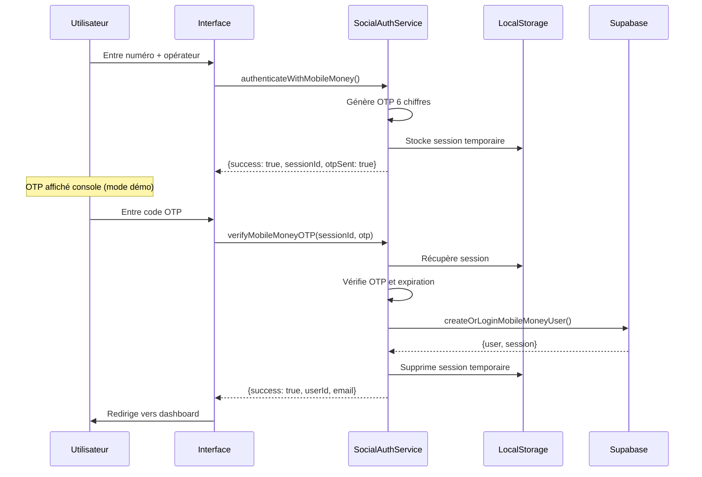

# Authentification Mobile Money

## Vue d'ensemble

Ce module fournit une solution d'authentification alternative via Mobile Money (Orange Money, MTN Mobile Money, Moov Money) pour contourner les limitations d'accès aux paramètres OAuth de Supabase.

## Fonctionnalités

- **Authentification par OTP SMS**: Vérification du numéro de téléphone via code à 6 chiffres
- **Support multi-opérateurs**: Orange Money, MTN Mobile Money, Moov Money
- **Création automatique de compte**: Pas besoin de configuration préalable
- **Intégration Supabase**: Utilise l'authentification email/password en arrière-plan
- **Sécurité**: Session temporaire avec expiration de 5 minutes

## Architecture

### Services

#### `SocialAuthService`
Service singleton qui gère l'authentification sociale alternative.

**Méthodes principales:**
- `authenticateWithMobileMoney(phoneNumber, operator)` - Envoie un code OTP
- `verifyMobileMoneyOTP(sessionId, otp)` - Vérifie le code et connecte l'utilisateur
- `linkMobileMoneyToAccount(userId, phoneNumber, operator)` - Lie Mobile Money à un compte existant
- `checkMobileMoneyExists(phoneNumber)` - Vérifie si un numéro est déjà enregistré

### Composants UI

#### `MobileMoneyLogin.tsx`
Formulaire d'authentification en deux étapes:
1. Saisie du numéro de téléphone et sélection de l'opérateur
2. Vérification du code OTP reçu

#### `SocialAuthConfig.tsx` (Admin)
Interface d'administration pour:
- Visualiser l'état des fournisseurs d'authentification
- Consulter les guides de configuration
- Comprendre le fonctionnement du système

### Intégration AuthContext

Le contexte d'authentification a été étendu avec:
- `loginWithMobileMoney(sessionId, otp)` - Méthode de connexion Mobile Money

## Flux d'authentification



## Format des données

### Structure de session OTP
```typescript
{
  phoneNumber: string;      // +225XXXXXXXX
  operator: 'orange' | 'mtn' | 'moov';
  otp: string;              // Code 6 chiffres
  timestamp: number;        // Date.now()
  expiresAt: number;        // timestamp + 5 minutes
}
```

### Email temporaire
Format: `{phoneNumberDigits}@mobilemoney.local`
Exemple: `2250102030405@mobilemoney.local`

### Mot de passe généré
Basé sur le numéro de téléphone + secret + timestamp
(Sécurisé car jamais exposé à l'utilisateur)

## Validation

### Numéro de téléphone
Formats acceptés:
- `0XXXXXXXX` (8-10 chiffres)
- `225XXXXXXXX`
- `+225XXXXXXXX`

Regex: `/^(\\+?225|0)?[0-9]{8,10}$/`

### Code OTP
- Exactement 6 chiffres
- Valide pendant 5 minutes
- Stocké de manière sécurisée (en production, utiliser un backend)

## Sécurité

### Mode Développement (Actuel)
- OTP stocké dans localStorage
- Code affiché dans la console navigateur
- Pas d'envoi SMS réel

### Mode Production (Recommandé)
1. **Backend sécurisé**: Ne jamais exposer les OTP côté client
2. **APIs SMS**: Intégrer les APIs officielles des opérateurs:
   - Orange Money API
   - MTN Mobile Money API
   - Moov Money API
3. **Rate limiting**: Limiter les tentatives d'OTP
4. **Monitoring**: Logger les tentatives de connexion
5. **Chiffrement**: Chiffrer les données sensibles en transit

## Configuration Production

### 1. Variables d'environnement
```env
# APIs Mobile Money
VITE_ORANGE_MONEY_API_KEY=xxx
VITE_MTN_MONEY_API_KEY=xxx
VITE_MOOV_MONEY_API_KEY=xxx

# URLs des APIs
VITE_ORANGE_MONEY_API_URL=https://api.orange.com/...
VITE_MTN_MONEY_API_URL=https://api.mtn.com/...
VITE_MOOV_MONEY_API_URL=https://api.moov.com/...
```

### 2. Backend pour OTP
Créer une Edge Function Supabase:

```typescript
// supabase/functions/send-mobile-money-otp/index.ts
Deno.serve(async (req) => {
  const { phoneNumber, operator, otp } = await req.json();

  // Appeler l'API SMS de l'opérateur
  const response = await fetch(getOperatorAPI(operator), {
    method: 'POST',
    headers: {
      'Authorization': `Bearer ${getOperatorKey(operator)}`,
      'Content-Type': 'application/json'
    },
    body: JSON.stringify({
      to: phoneNumber,
      message: `Votre code de vérification est: ${otp}`,
      sender: 'AgriMarket'
    })
  });

  return new Response(JSON.stringify({ success: true }));
});
```

### 3. Stockage sécurisé des OTP
Utiliser la base de données Supabase:

```sql
-- Table pour stocker les sessions OTP
CREATE TABLE mobile_money_sessions (
  id UUID PRIMARY KEY DEFAULT gen_random_uuid(),
  phone_number TEXT NOT NULL,
  operator TEXT NOT NULL,
  otp_hash TEXT NOT NULL,  -- Ne jamais stocker en clair
  created_at TIMESTAMPTZ DEFAULT NOW(),
  expires_at TIMESTAMPTZ NOT NULL,
  verified BOOLEAN DEFAULT FALSE,
  attempts INTEGER DEFAULT 0
);

-- Index pour performance
CREATE INDEX idx_mobile_money_phone ON mobile_money_sessions(phone_number);
CREATE INDEX idx_mobile_money_expires ON mobile_money_sessions(expires_at);

-- RLS
ALTER TABLE mobile_money_sessions ENABLE ROW LEVEL SECURITY;

-- Seule l'Edge Function peut accéder (via service_role)
```

## Tests

### Tester en local
1. Ouvrir la console navigateur (F12)
2. Aller sur `/login/mobile-money`
3. Entrer un numéro de test: `0102030405`
4. Sélectionner un opérateur
5. Le code OTP sera affiché dans la console
6. Entrer le code pour se connecter

### Numéros de test
Pour faciliter les tests, ces numéros peuvent être utilisés:
- `0700000001` - Orange Money
- `0500000001` - MTN Money
- `0100000001` - Moov Money

## Limites actuelles

1. **Pas d'envoi SMS réel**: Le code est affiché dans la console
2. **Stockage localStorage**: En production, utiliser un backend sécurisé
3. **Pas de rate limiting**: Peut être abusé en mode démo
4. **Validation basique**: Améliorer la validation du format de numéro

## Roadmap

- [ ] Intégration APIs SMS des opérateurs
- [ ] Backend sécurisé pour gestion OTP
- [ ] Rate limiting et protection anti-spam
- [ ] Support de la récupération de compte
- [ ] Historique des connexions
- [ ] Support 2FA pour comptes sensibles
- [ ] Intégration paiements Mobile Money

## Support

Pour toute question ou problème:
1. Consulter la documentation dans le Dashboard Admin
2. Vérifier les logs dans la console navigateur
3. Contacter l'équipe technique

## Ressources

- [Documentation Supabase Auth](https://supabase.com/docs/guides/auth)
- [Orange Money API](https://developer.orange.com/apis/mobile-money)
- [MTN Mobile Money API](https://momodeveloper.mtn.com/)
- [Moov Money API](https://www.moov-africa.ci/developers)
